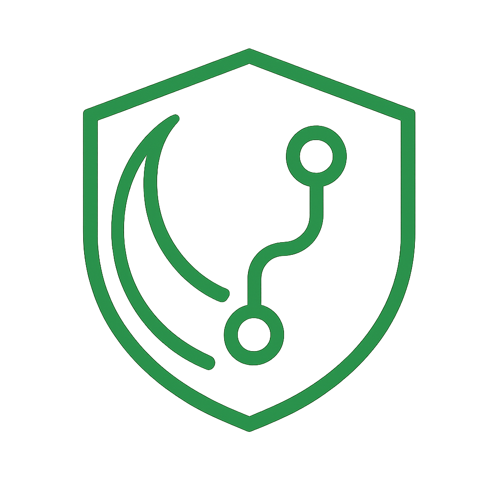

<p align="center">
  
</p>

<h1 align="center">The Night Agent</h1>

<p align="center">
  <strong>Autonomous Production Incident Response System</strong>
</p>

<p align="center">
  <a href="#features">Features</a> •
  <a href="#architecture">Architecture</a> •
  <a href="#tech-stack">Tech Stack</a> •
  <a href="#getting-started">Getting Started</a> •
  <a href="#how-it-works">How It Works</a> •
  <a href="#limitations">Limitations</a>
</p>

<p align="center">
  
  
  
  
  
</p>

---

## Overview

**The Night Agent** is an autonomous incident response system that monitors your production applications, detects anomalies, performs root cause analysis, and proposes fixes—all while you're away from your desk.

When something goes wrong in production, The Night Agent:
- 🔍 **Detects** anomalies in real-time via lightweight sidecar agents
- 🧠 **Analyzes** the root cause using AI-powered analysis
- 🔧 **Proposes** code fixes with full context
- ✅ **Applies** changes to a sandbox branch for your review
- 🚀 **Merges** approved fixes back to your main branch

Your existing CI/CD pipeline takes it from there—build, test, deploy. Crisis averted.

---

## Features

- **Zero-Friction Monitoring** — Lightweight sidecar agent deploys in seconds via Docker
- **Intelligent Triage** — AI filters noise to surface only critical issues
- **Root Cause Analysis** — Traces errors back to their origin in your codebase
- **Automated Fix Proposals** — Generates patches with full diff preview
- **Human-in-the-Loop** — You approve every change before it's applied
- **Git-Native Workflow** — Works with any Git provider (GitHub, GitLab, Bitbucket)
- **Provider Agnostic** — Uses standard Git operations, no vendor lock-in

---

## Architecture

```
┌─────────────────────────────────────────────────────────────────────────────────┐
│                              THE NIGHT AGENT ARCHITECTURE                        │
└─────────────────────────────────────────────────────────────────────────────────┘

                                    ┌──────────────┐
                                    │   Frontend   │
                                    │   (Next.js)  │
                                    └──────┬───────┘
                                           │
                                           ▼
┌─────────────┐    Anomalies     ┌─────────────────┐     Git Ops      ┌──────────────┐
│   Sidecar   │ ───────────────▶ │     Backend     │ ◀──────────────▶ │  Git Repos   │
│   Agent     │   POST /anomaly  │    (NestJS)     │   clone/push     │ (Any Provider)│
│  (Docker)   │ ◀─────────────── │                 │                  │              │
└─────────────┘   API Key Auth   └────────┬────────┘                  └──────────────┘
      │                                   │
      │ Monitors                          │ Triggers
      ▼                                   ▼
┌─────────────┐                  ┌─────────────────┐
│ Application │                  │     Kestra      │
│    Logs     │                  │  Orchestrator   │
└─────────────┘                  └────────┬────────┘
                                          │
                    ┌─────────────────────┼─────────────────────┐
                    │                     │                     │
                    ▼                     ▼                     ▼
           ┌──────────────┐      ┌──────────────┐      ┌──────────────┐
           │  Validator   │      │   Analysis   │      │  Apply Fix   │
           │    Agent     │      │    Agent     │      │    Agent     │
           │  (Bedrock)   │      │  (Bedrock)   │      │  (Bedrock)   │
           └──────────────┘      └──────────────┘      └──────────────┘
```

---

## How It Works

### 1️⃣ Onboarding Flow

```
┌──────────────┐         ┌──────────────┐         ┌──────────────┐
│    User      │         │   Backend    │         │   Database   │
│  (Frontend)  │         │   (NestJS)   │         │   (Prisma)   │
└──────┬───────┘         └──────┬───────┘         └──────┬───────┘
       │                        │                        │
       │  1. Sign Up / Login    │                        │
       │───────────────────────▶│                        │
       │                        │  2. Create User        │
       │                        │───────────────────────▶│
       │                        │                        │
       │  3. Connect Repository │                        │
       │───────────────────────▶│  4. Store Repo Config  │
       │    (URL + SSH/HTTPS)   │───────────────────────▶│
       │                        │                        │
       │                        │  5. Clone Repository   │
       │                        │───────────────────────▶│ (workspace)
       │                        │                        │
       │  6. Create Sidecar     │                        │
       │───────────────────────▶│  7. Generate API Key   │
       │                        │───────────────────────▶│
       │                        │                        │
       │◀───────────────────────│                        │
       │  8. Docker Command     │                        │
       │     (with API Key)     │                        │
       │                        │                        │
```

**Endpoints:**
- `POST /auth/signup` — Create user account
- `POST /auth/login` — Authenticate and get JWT
- `POST /api/onboard` — Connect repository
- `POST /api/sidecars` — Create sidecar agent (returns Docker command)

---

### 2️⃣ Sidecar Agent Setup

The sidecar is a lightweight Docker container that monitors your application logs.

```bash
# User receives this command after creating a sidecar:
docker run -d \
  --name night-agent-sidecar \
  --restart unless-stopped \
  -e SIDECAR_ID="<auto-generated-uuid>" \
  -e SIDECAR_API_KEY="<auto-generated-key>" \
  -e BACKEND_URL="https://your-night-agent.com/api/sidecar" \
  -e SERVICE_ID="my-production-app" \
  -v /var/log/myapp:/app/logs:ro \
  ghcr.io/your-org/night-agent-sidecar:latest
```

**What it does:**
- Tails your application log files
- Uses statistical + rule-based anomaly detection
- Sends detected anomalies to backend with API key authentication
- Sends heartbeats every 30 seconds

---

### 3️⃣ Anomaly Detection & Reporting

```
┌──────────────┐         ┌──────────────┐         ┌──────────────┐
│   Sidecar    │         │   Backend    │         │   Database   │
│   (Docker)   │         │   (NestJS)   │         │   (Prisma)   │
└──────┬───────┘         └──────┬───────┘         └──────┬───────┘
       │                        │                        │
       │  Monitor Logs          │                        │
       │  ════════════          │                        │
       │                        │                        │
       │  Anomaly Detected!     │                        │
       │                        │                        │
       │  POST /api/sidecar/anomaly                      │
       │───────────────────────▶│                        │
       │  Header: X-Sidecar-API-Key                      │
       │  Body: {severity, message, logs, traceId}       │
       │                        │                        │
       │                        │  Validate API Key      │
       │                        │  Store Anomaly         │
       │                        │───────────────────────▶│
       │                        │                        │
       │◀───────────────────────│                        │
       │  {status: "received"}  │                        │
```

**Endpoints:**
- `POST /api/sidecar/anomaly` — Report detected anomaly
- `POST /api/sidecar/heartbeat` — Sidecar health check
- `POST /api/sidecar/register` — Register sidecar with backend

---

### 4️⃣ Kestra Orchestration Pipeline

Kestra orchestrates the AI agents that process anomalies. Here's the complete workflow:

```
┌─────────────────────────────────────────────────────────────────────────────┐
│                         KESTRA WORKFLOW ORCHESTRATION                        │
└─────────────────────────────────────────────────────────────────────────────┘

    ⏰ Trigger: Every 15 minutes
           │
           ▼
┌─────────────────────────────────────────────────────────────────────────────┐
│  STAGE 1: VALIDATION                                                         │
│  ┌──────────────────┐                                                        │
│  │  Validator Agent │  • Fetches pending anomalies from backend              │
│  │    (Bedrock)     │  • Analyzes each anomaly using LLM                     │
│  │                  │  • Classifies: CRITICAL | HIGH | LOW | IGNORE          │
│  └────────┬─────────┘                                                        │
│           │                                                                  │
│           ▼                                                                  │
│   Only CRITICAL anomalies proceed ───────────▶ Others archived              │
└─────────────────────────────────────────────────────────────────────────────┘
           │
           ▼
┌─────────────────────────────────────────────────────────────────────────────┐
│  STAGE 2: ROOT CAUSE ANALYSIS                                                │
│  ┌──────────────────┐                                                        │
│  │  Analysis Agent  │  • Examines error logs and stack traces               │
│  │    (Bedrock)     │  • Identifies relevant files in codebase              │
│  │                  │  • Produces detailed RCA report                        │
│  └────────┬─────────┘                                                        │
│           │                                                                  │
│           ▼                                                                  │
│   POST /api/internal/anomalies/analysis                                      │
│   {root_cause, relevant_files[], suggested_approach}                         │
└─────────────────────────────────────────────────────────────────────────────┘
           │
           ▼
┌─────────────────────────────────────────────────────────────────────────────┐
│  STAGE 3: FIX PROPOSAL                                                       │
│  ┌──────────────────┐                                                        │
│  │ Propose Fix Agent│  • Searches codebase for issue origin                 │
│  │    (Bedrock)     │  • Reads relevant source files                        │
│  │                  │  • Generates unified diff patch                        │
│  └────────┬─────────┘                                                        │
│           │                                                                  │
│           ▼                                                                  │
│   POST /api/internal/anomalies/proposal                                      │
│   {analysis, patch (diff format), status: "PROPOSAL_READY"}                  │
│                                                                              │
│   ════════════════════════════════════════════════════════                   │
│   │ 👤 USER ACTION REQUIRED: Review & Approve Fix on Frontend │              │
│   ════════════════════════════════════════════════════════                   │
└─────────────────────────────────────────────────────────────────────────────┘
           │
           │ User clicks "APPROVE FIX"
           ▼
┌─────────────────────────────────────────────────────────────────────────────┐
│  STAGE 4: APPLY TO SANDBOX                                                   │
│  ┌──────────────────┐                                                        │
│  │ Apply Fix Agent  │  • Checks out main/master branch                      │
│  │   (Git + Patch)  │  • Creates sandbox branch: fix/{repo}/{id}            │
│  │                  │  • Applies diff patch to codebase                      │
│  │                  │  • Commits changes                                     │
│  └────────┬─────────┘                                                        │
│           │                                                                  │
│           ▼                                                                  │
│   POST /api/fix/{id}/apply-sandbox                                           │
│   Response: {status: "sandbox_initiated", sandboxBranch: "fix/..."}          │
│                                                                              │
│   ════════════════════════════════════════════════════════                   │
│   │ 👤 USER ACTION: Review Git Diff on Frontend                │              │
│   ════════════════════════════════════════════════════════                   │
└─────────────────────────────────────────────────────────────────────────────┘
           │
           │ User clicks "MERGE & PUSH"
           ▼
┌─────────────────────────────────────────────────────────────────────────────┐
│  STAGE 5: MERGE & PUSH                                                       │
│  ┌──────────────────┐                                                        │
│  │   Merge Action   │  • Checks out target branch (main/master)             │
│  │      (Git)       │  • Merges fix branch with --no-ff                     │
│  │                  │  • Pushes to remote origin                             │
│  │                  │  • Deletes fix branch (cleanup)                        │
│  └────────┬─────────┘                                                        │
│           │                                                                  │
│           ▼                                                                  │
│   POST /api/fix/{id}/merge                                                   │
│   Response: {status: "merged_and_pushed", targetBranch: "main"}              │
│                                                                              │
│   ════════════════════════════════════════════════════════                   │
│   │ 🚀 CI/CD PIPELINE TRIGGERED: Build → Test → Deploy        │              │
│   ════════════════════════════════════════════════════════                   │
└─────────────────────────────────────────────────────────────────────────────┘
```

---

### 5️⃣ Git Integration

The Night Agent uses **standard Git operations** via the `simple-git` library, making it compatible with any Git provider:

| Operation | Command | Purpose |
|-----------|---------|---------|
| Clone | `git clone` | Initial repository setup during onboarding |
| Checkout | `git checkout -b` | Create sandbox branch for fixes |
| Apply | `git apply` | Apply generated diff patch |
| Commit | `git commit` | Save fix changes |
| Merge | `git merge --no-ff` | Merge approved fixes |
| Push | `git push origin` | Push to remote repository |
| Branch List | `git branch -a` | Show available branches for merge target |

**Provider Agnostic Design:**
- Works with GitHub, GitLab, Bitbucket, or self-hosted Git servers
- Supports both HTTPS (with PAT) and SSH authentication
- No provider-specific APIs used for core operations

---

## Tech Stack

| Layer | Technology | Purpose |
|-------|------------|---------|
| **Frontend** | Next.js 14 | Dashboard UI for anomaly management |
| **Backend** | NestJS (Node.js) | REST API, authentication, Git operations |
| **Orchestration** | Kestra | Workflow automation for AI agents |
| **AI/LLM** | AWS Bedrock (Claude) | Anomaly validation, RCA, fix generation |
| **Sidecar** | Python + Docker | Lightweight log monitoring agent |
| **Database** | SQLite + Prisma | Data persistence and ORM |
| **VCS** | Git (simple-git) | Version control operations |
| **Auth** | JWT + Passport | User authentication |

---

## Getting Started

### Prerequisites

- Docker & Docker Compose
- Node.js 18+
- Python 3.11+ (for sidecar development)
- AWS credentials (for Bedrock access)
- Git repository to monitor

### Quick Start

```bash
# 1. Clone the repository
git clone https://github.com/your-org/the-night-agent.git
cd the-night-agent

# 2. Start all services (Kestra + Backend)
./scripts/start-all.sh

# 3. Start the frontend (separate terminal)
cd frontend && npm install && npm run dev

# 4. Open http://localhost:3000
#    - Sign up for an account
#    - Connect your repository
#    - Create a sidecar agent
#    - Copy and run the Docker command
```

### Environment Variables

```bash
# Backend (.env)
DATABASE_URL="file:./prisma/dev.db"
JWT_SECRET="your-secret-key"
AWS_REGION="us-east-1"
AWS_ACCESS_KEY_ID="..."
AWS_SECRET_ACCESS_KEY="..."

# Kestra
KESTRA_USERNAME="admin@kestra.io"
KESTRA_PASSWORD="Admin1234"
```

---

## API Reference

### Sidecar Endpoints

| Method | Endpoint | Auth | Description |
|--------|----------|------|-------------|
| POST | `/api/sidecar/register` | API Key | Register sidecar with backend |
| POST | `/api/sidecar/anomaly` | API Key | Report detected anomaly |
| POST | `/api/sidecar/heartbeat` | API Key | Health check / keepalive |

### Frontend Endpoints

| Method | Endpoint | Auth | Description |
|--------|----------|------|-------------|
| GET | `/api/anomalies` | JWT | List all anomalies |
| GET | `/api/fix/:id` | JWT | Get fix proposal details |
| GET | `/api/fix/:id/diff` | JWT | Get applied changes diff |
| GET | `/api/fix/:id/branches` | JWT | List available branches |
| POST | `/api/fix/:id/apply-sandbox` | JWT | Apply fix to sandbox branch |
| POST | `/api/fix/:id/merge` | JWT | Merge and push fix |

### Sidecar Management

| Method | Endpoint | Auth | Description |
|--------|----------|------|-------------|
| POST | `/api/sidecars` | JWT | Create new sidecar (returns Docker command) |
| GET | `/api/sidecars` | JWT | List user's sidecars |
| DELETE | `/api/sidecars/:id` | JWT | Delete a sidecar |

---

## Limitations & Considerations

### Current Limitations

| Limitation | Impact | Mitigation |
|------------|--------|------------|
| **Local SQLite Database** | Not suitable for production; single-node only | Migrate to PostgreSQL for production deployments |
| **Repository Storage** | Cloned repos consume disk space; scaling challenge | Implement repo cleanup policies; consider shallow clones |
| **LLM Dependency** | Heavy reliance on LLM for validation may increase latency/cost | Local validation at sidecar level reduces unnecessary API calls |
| **CI/CD Assumption** | Assumes existing DevOps pipeline for deployment | Document manual deployment steps as fallback |

### Design Trade-offs

| Decision | Rationale |
|----------|-----------|
| **Lightweight Sidecar** | Prioritizes minimal friction for client deployment over advanced local analysis |
| **Human-in-the-Loop** | AI proposes, human approves—ensures safety but requires user availability |
| **Git-Native Operations** | Provider agnostic but requires repository cloning |

### Security Considerations

- API keys are generated server-side and shown only once
- JWT tokens for frontend authentication
- SSH key generation for secure Git access
- Sensitive credentials encrypted at rest

---

## Roadmap

- [ ] PostgreSQL support for production deployments
- [ ] Slack/Discord notifications for critical anomalies
- [ ] Multi-tenant support with team management
- [ ] Webhook integration for CI/CD triggers
- [ ] Support for additional LLM providers (OpenAI, Anthropic direct)
- [ ] Kubernetes sidecar deployment option

---

<p align="center">
  <sub>Built with ❤️ for developers who value their sleep</sub>
</p>

